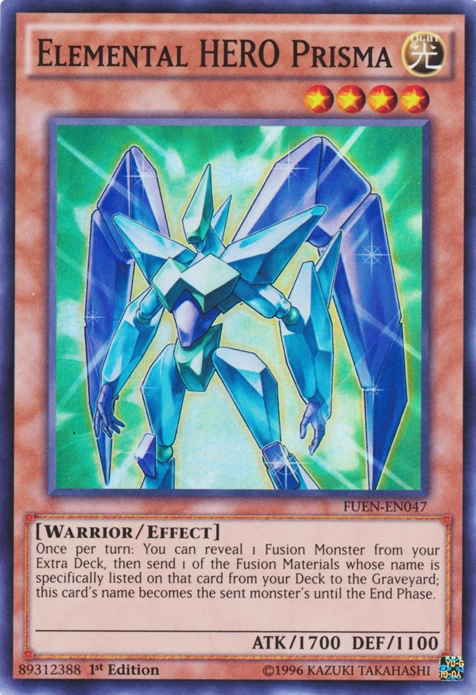

# create-next-app

next.js typescript 프로젝트 생성
...
npx create-next-app <폴더명> --typescript
...

# 마크다운 파일 사용법

확장프로그램 - Markdown Preview Enhanced 설치 - ctrl shirt P - Markdown 미리보기 열기

# 마크다운에 이미지 넣기

1.

```

```

2.

```

```

# tailWind 설치 방법

1. tailwind 홈페이지 - Get Started - FrameWork - Next.js <br>
   [tailWind 설치 링크](https://tailwindcss.com/docs/guides/nextjs)

2. 터미널에 설치 명령어 입력.

```
> npm install -D tailwindcss postcss autoprefixer
> npx tailwindcss init -p
```

- npm : npm에서 패키지를 설치.
- -D : Develop, 개발자 옵션으로 설치.

3. package.json - devDependencies 목록에 tailWindcss 추가됐는지 확인.

4. 최상위 폴더에 `tailwind.config.js` 생성 후 다음 코드 복사.

```
/** @type {import('tailwindcss').Config} */
module.exports = {
  content: [
    "./pages/**/*.{js,ts,jsx,tsx}",
    "./components/**/*.{js,ts,jsx,tsx}",
  ],
  theme: {
    extend: {},
  },
  plugins: [],
}
```

5. `./style/globals.css` 최상단에 TailWind 지시문 추가.

```
@tailwind base;
@tailwind components;
@tailwind utilities;
```

6. 빌드 프로세스 시작.

```
>npm run dev
```

7. CSS로 스타일 지정해서 잘 돌아가는지 확인.

```
<h1 className="text-3xl font-bold underline">
      Hello world!
    </h1>
```

# Prisma


- 차세대 Node.js, TypeScript의 Database ORM
- Next.js의 데이터베이스 적용을 위해 설치.
- ORM이란 · 객체와 관계형 데이터베이스의 데이터를 자동으로 매핑(연결)해주는 것
- 단순하게 표현하면 객체와 관계와의 설정이라 할 수 있다.
- 데이터베이스 객체와 관계를 연결해주는 방식, 그것이 ORM.

* [prisma-공식 Document](https://www.prisma.io/docs/concepts/components/prisma-client/)

1. VSCODE `prisma` 확장프로그램 설치.

- 코드 자동 완성 기능 추가.

* VSCODE에서 prisma의 사용을 도와준다.

2. `prisma` 패키지 설치

```
> npm i prisma -D
> npx prisma init
```

### 실행후 명령어

---

✔ Your Prisma schema was created at prisma/schema.prisma
You can now open it in your favorite editor.

warn You already have a .gitignore file. Don't forget to add `.env` in it to not commit any private information.

Next steps:

1. Set the DATABASE_URL in the .env file to point to your existing database. If your database has no tables yet, read https://pris.ly/d/getting-started
2. Set the provider of the datasource block in schema.prisma to match your database: postgresql, mysql, sqlite, sqlserver, mongodb or cockroachdb.
3. Run prisma db pull to turn your database schema into a Prisma schema.
4. Run prisma generate to generate the Prisma Client. You can then start querying your database.

---

### ↑ 번역 및 정리

- prisma 폴더 안에 `schema.prisma`, 파일이 생성되었다.
- 네가 좋아하는 에디터로 편집하여라.

* `warn` : 당신은 이미 `.gitignore` 파일이 있다.
* 개인 정보를 범하지 않도록 새로 생성된 `.env`를 추가하는 것을 잊지 마십시오.

```
//..gitignore
.env
```

- next steps :

1. `.env` 파일에 당신의 데이터베이스 주소를 입력하세요.

```
//.env
DATABASE_URL=내 DB 주소
//" " 안 넣는다.
```

2. `schema.prisma` 파일에 당신이 사용할 DB 종류를 입력하세요.<br>
   (postgresql, mysql, sqlite, sqlserver, mongodb or cockroachdb.)

```
//schema.prisma
datasource db {
  provider = "mongodb" // 사용할 DB 지정.
  url      = env("DATABASE_URL")
}
```

- 몽고DB는 대표적인 NoSQL방식의 데이터베이스
  (메인 구글 계정에 올렸음.)

* 프리티어가 schema.prisma에서 자동 줄맞춤이 되려면 vsCode 맨 오른쪽 아래 종 모양 선택하고 확장 프로그램 선택을 해줘야 한다.

3. `model User{ }`에 DB 데이터 작성.

4. DB에 스키마 업로드.
   놀랍게도 RAM 용량이 모자르면 에러 뜬다.(os error 10051)
   ```
   an error occurred during dns resolution: proto error: io error: 연결할 수 없는 네트워크에서 소켓 작업을 시도했습니다. (os error 10051) 0: migration_core::state::schemapush
   ```

```
> npx prisma db push
```

5. `prisma studio` 실행 - 데이터 베이스 웹 클라이언트로 DB를 볼 수 있다.
   단, 이 명령어가 실행 중일 때만 사용 가능하다.

```
> npx prisma studio
```

몽고DB에는 아이디가 무조건 있어야 한다.

## schema.prisma

```
model User {
  id       String   @id @default(auto()) @map("_id") @db.ObjectId
  // Other fields
  name     String
  age      Int
  addr     String
  test     String?
  favfood  String?  @default("없음")
  createAt DateTime @default(now())
  updateAt DateTime @updatedAt
}
```

- 몽고DB에는 아이디가 무조건 있어야 한다.
- 있어도 되고 없어도 되는건 타입 뒤에 ?를 붙인다. ex)String?
- createAt : 등록한 시간, 디폴트로 현재 시간을 넣는다.
- updatedAt : 파일 바뀐 시간을 기록.

6. `prisma` client 설정

```
> npx prisma generate
```

# CRUD

Create / Read / Update / Delete
[primsa doc - CRUD](https://www.prisma.io/docs/concepts/components/prisma-client/crud)

## 1. Create

### 코드로 DB에 데이터를 추가해보자.

1. `../../libs/server/client`

```
//
import { PrismaClient } from "@prisma/client";
export default new PrismaClient();
```

- DB 접속해서 모든걸 할 수 있게 해주는 코드

* 다른 파일에서 사용할 수 있게 한다.

2.  본격적인 사용 방법

### ㅁ 기본적으로 이거만 외우고 나머진 자동 완성으로 처리하자.

```
client.user.create({ data: {} });
```

`pages\api\adduser.ts`

```
 try {
    const NewUser = await client.user.create({
      data: { name: "백메탈", age: 4, addr: "아산시" },
    });
    res.status(200).json({ name: "OKOKOK" });
  } catch (err) {
    res.status(200).json({ name: "NGNGNG" });
  }
```

- `client.user.create({ data: { name: "백메탈", age: 20, addr: "아산시" } });`
  - ㄴ 클라이언트 사이드에서는 보안 문제로 실행이 불가능하다.
  - 프리즈마 코드는 서버 사이드에서만 실행할 수 있다.

* `client.user.create() `: 서버 사이드에서만 동작한다.
* async와 await는 한 세트이므로 fucntion 앞에 async도 추가하자.

- 코드가 있는 페이지를 새로고침할수록 `create` 메서드가 동작하여 `백메탈`을 계속 추가한다.

- 변경할 때 다음 코드를 import 하는걸 잊지말자.

```
import {User} from "@prisma/client"
```

- `C:\Users\SJ\Desktop\nodejs\device_manager_TypeSrpt\pages\api\alluser.ts`

```
export default async function handler(
  req: NextApiRequest,
  res: NextApiResponse<ResponseDataType>
) {
  try {
    const users = await client.user.findMany();
    console.log(users);
    //res.status(200).json({ name: "AllUser-okokok", users: users });
    //↑↓ 는 동일한 코드다.
    res.status(200).json({ name: "AllUser-okokok", users });
  } catch (err) {}
}
```

- ex6 문법 : model Users와 const users의 이름이 같다.
- 이 경우, users 이름으로 변수 하나를 그대로쓸 수 있다.

### 사용자를 index에 출력해보자.

### fetch 하는 방법

- fetch안에 주소를 넣으면 기본적으로 get 메서드를 호출하고
- 호출한 결과를 res 변수에 담아서 그걸 .json으로 결과 데이터를 json 형태로 바꿔서
- 그걸 리턴해서 json 변수에 담아서 그걸 콘솔.로그에서 출력.
- 두번째 json은 메서드가 아니라 변수로 판명됨.

* 그걸 users에 담기 위해 콘솔.로그를 setUsers로 바꿔준다.

```
  useEffect(() => {
    fetch("/api/alluser")
      .then((res) => res.json())
      .then((json) => setUsers(json.users));
    // console.log(users);
  }, []);
```

### 타입스크립트 오류를 잠시 우회하고 싶으면 주석으로 달아서 밑의 한 줄만 오류를 우회한다. 급할 때만 쓰자.

```
// @ts-ignore

```

# 몰입형 교육 5-17

오늘은 노션 한번 테스트 해보자.

_타입 스크립트에서 이벤트 호출_

- 타입 스크립트의 도움 : 타입 스크립트는 메서드 호출할 때 점 찍으면 ctrl+space로 자동 완성을 불러올 수 있다.
- 함수 정의할 때 인자를 “ele:String”처럼 타입 지정을 해줘야 한다.
- 지정 후 자동 완성을 쓰면 쓸 수 있는 메서드 리스트가 나온다.
- input onchange event의 타입을 모두가 궁금해 한다.
  - const ch = ( event ) ⇒ {
    setText(event.currentTarget.value);}
  - const ch = ( event: **React.ChangeEvent<HTMLInputElement>** ) ⇒ {
    setText(event.currentTarget.value);}
- 사용하는 태그, 속성(핸들러)가 달라지면 쓰는 타입 지정도 달라진다.
- 이럴 땐 태그, 속성, 타입스크립트 등의 키워드로 구글 검색해보자.

- 타입 스크립트를 잠시 우회하고 싶으면 주석으로 달아서 밑의 한 줄만 오류를 우회한다. 급할 때만 쓰자.

```tsx
// @ts-ignore
```

😓 현재 ㅈ된 부분 : api/user/의 ts 파일들이 다 연동이 안되어 있음.

프리티어 자동 정렬 적용이 안되어 있다.

- 현재는 이 형식을 암기해두자.

```tsx
fetch("/api/adduser2")
  .then((res) => res.json())
  .then((json) => console.log(json));
```

```tsx
setUsers([...users, json.user]);
```

… : 중, 대 괄호를 해제한다.

- 거기에 다시 괄호를 붙이면 원래대로 들어간다,.
- 위 코드는
  - users = [ {}, {}, {], … ] 로 있는걸
  - users = {}, {}, {], …
  - users = {}, {}, {], … , {새 유저}
  - users = [ {}, {}, {], … , {새 유저} ]
- 의 순서로 새로 고침 없이 데이터베이스 출력한 목록에 데이터를 추가하자마자 화면 갱신을 할 수 있다.

Delete

- filter 함수로 삭제할 ID가 아닌 ID만 모아서 새 배열을 만들어 setUsers에 리턴한다.

# 22-09-28

### select 태그

```tsx
<div data-comment={"입력5"} className="flex flex-col">
            <span>장치 종류 *</span>
            <select name="choice" className="setting_input">
              <option hidden selected>
                장치 종류를 선택하세요.
              </option>
              <option value="banana">온도 센서</option>
              <option value="apple">습도 센서</option>
              <option value="orange">CO2 센서</option>
            </select>
```

- selected : 처음에 자동으로 지정됨.
- hidden : 처음에만 표시하고 선택은 못하게 함.
- 이상하게 selected 들어가면 오류 난다.

### 데이터베이스 Device와 Sencing

```
model Device {
  id       String   @id @default(auto()) @map("_id") @db.ObjectId
  createAt DateTime @default(now())
  updateAt DateTime @updatedAt
product String
location  String
type  String // TEMP HUMI CO2
unit  String
memo  String?

sencings Sencing[]
}
//이거 자동정렬 어케 하드라?

//센서의 양이 많으니, 디바이스와 분리하여 관리하고, 서로 값 참조하게 한다.
model Sencing {
  id   String   @id @default(auto()) @map("_id") @db.ObjectId
  createAt DateTime @default(now())
  updateAt DateTime @updatedAt

  value Float
}

```

- 센싱에서 처리하는 데이터량이 많으니, 디바이스와 분리하여 관리한다.
- 둘 사이의 관계를 맺게 하여 데이터를 서로 참조시킨다.
- 디바이스의 “디바이스id” ↔ 센싱의 “디바이스id”를 서로 참조하게 한다.

## Prettier 자동정렬 적용

2. User(사용자) > TextEditor(텍스트 편집기) > Formatting(서식)

- Format On Paste

: 사용자가 코드를 붙여넣기 했을 때, 자동으로 코드를 정렬

- Format On Save

: 사용자가 코드를 저장 했을 때, 자동으로 코드를 정렬

- Format On Type

: 사용자가 코드를 입력할 때, 자동으로 코드를 정렬

[적용이 안되는 경우]
File(파일) > Preferences(기본 설정) 으로 들어가서 'Default Formatter' 검색

하단의 설정이 null로 되어있을텐데 이걸 'enbenp.prettier-vscode'로 바꿔준다.
